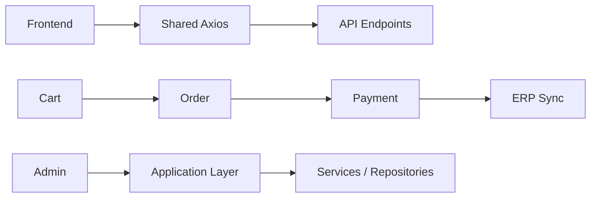

# Laravel B2B E-Commerce & ERP Integration Platform
[](https://github.com/mehmetalay/laravel-b2b-ecommerce/actions/workflows/ci-quality.yml)

## Overview

This project is a Laravel 8 based B2B e-commerce platform with ERP-connected business workflows.

It includes:
- Dealer / subdealer account structure
- Product, category, brand, and campaign management
- Order and payment lifecycle management
- Admin panel and frontend user area
- Domain-oriented `app/Application/*` architecture
- Progressive frontend modularization and Vue-based admin components

## Core Features

- **B2B structure**: dealer, subdealer, and salesman-oriented flows
- **Product & Catalog Management**: products, categories, brands, attributes, and related admin operations
- **Order System**: order creation, approval, status tracking, and reporting
- **Payment Infrastructure**: payment links, callback handling, refund/cancel flows, and reporting
- **ERP Integration**: synchronization and data exchange workflows with external ERP systems

## Payment Infrastructure

The codebase includes virtual POS-oriented payment workflows compatible with providers used in local banking operations, including:

- Akbank
- İş Bankası
- Yapı Kredi
- VakıfBank
- Vakıf Katılım
- Ziraat
- Halkbank
- QNB
- DenizBank
- TEB

## Architecture

The backend is organized with a domain-oriented Application layer and supporting services:

- Application layer modules
- Services
- Actions
- DTO / Data objects
- Validators
- Repositories
- Enums
- Exceptions
- Query structures

```text
app/Application
|-- Payment
|-- Order
|-- Cart
|-- Product
|-- Category
|-- Brand
|-- Campaign
|-- DealerApplication
|-- Contract
|-- Survey
`-- ...
```

## Frontend Architecture

- Laravel Mix based asset pipeline
- Blade-rendered frontend pages
- Vue-based admin components for modernized admin screens
- Shared Axios request layer
- Modular JavaScript structure
- ServerDataTable based reusable admin table structure

Reference path:

`resources/js/shared/request-axios.js`

## Queue & Retry Structure

Queue-backed and retry-safe workflows are used for operational tasks such as:

- Mail dispatch
- ERP sync processes
- Export jobs
- Retry-safe background operations

## Documentation

- [Architecture](docs/architecture.md)
- [Payment Flow](docs/payment-flow.md)
- [ERP Integration](docs/erp-integration.md)
- [Frontend Architecture](docs/frontend-architecture.md)
- [Queue & Retry](docs/queue-retry.md)
- [Engineering Decisions](docs/engineering-decisions.md) - Design rationale and trade-offs are documented here.

## Project Policies

- [Contributing](CONTRIBUTING.md)
- [Changelog](CHANGELOG.md)
- [Security](SECURITY.md)
- [License](LICENSE)

## Technologies

### Backend

- PHP
- Laravel 8
- MySQL
- SQL Server
- Redis

### Frontend

- Blade
- JavaScript
- Vue.js
- Axios
- Bootstrap
- Laravel Mix

## Integrations

- ERP Systems
- Virtual POS / Bank APIs
- FTP Services
- Mail Services
- SMS Services

## Security Notes

- Sensitive credentials removed from repository
- Debug mode disabled for production usage
- Public batch mail routes removed
- Internal HTTP-triggered mail flow refactored to service-based dispatch
- Logs, cache, and upload/generated artifacts excluded from git

## Installation

```bash
composer install
npm install
cp .env.example .env
php artisan key:generate
php artisan migrate
npm run dev
php artisan queue:work
```

## Environment Variables

Example ERP-related variables:

```env
ERP_CONNECTION=sqlsrv
ERP_HOST=
ERP_PORT=1433
ERP_DATABASE=
ERP_USERNAME=
ERP_PASSWORD=
ERP_BASE_URL=
```

## Screenshots

Screenshots can be added under `docs/screenshots/`.

## Testing

```bash
php artisan test
```

## Production Recommendations

```bash
php artisan optimize
php artisan config:cache
php artisan route:cache
php artisan view:cache
```

## Repository Structure

- `app/` core backend domain and application logic
- `resources/views/` Blade templates
- `resources/js/` frontend modules and Vue/admin components
- `routes/` route definitions (frontend, backend, API)
- `config/` environment-dependent configuration

## Technical Highlights

- Provider-based payment infrastructure
- ERP synchronization workflows
- Queue/retry-safe operations
- Shared Axios request layer
- Progressive frontend migration
- Idempotent callback handling

## Engineering Challenges

- Preventing duplicate payment callback side effects
- Designing retry-safe ERP synchronization
- Migrating legacy frontend modules incrementally
- Refactoring public/internal mail trigger flows into service/command architecture
- Keeping B2B order/payment flows transaction-safe

## Architecture Snapshot



## License

This project is distributed under the Commercial Showcase License in [`LICENSE`](LICENSE).

## Author

Mehmet Alay
