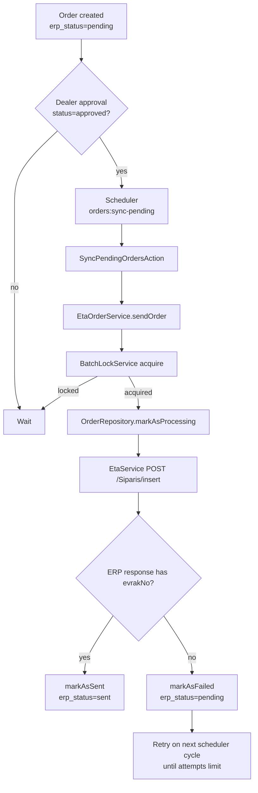

# ERP Integration

## Scope
ERP integration in this repository has two directions:
- Inbound synchronization from SQL Server ERP views into local B2B tables
- Outbound synchronization of approved orders and successful payments to ETA ERP APIs

## Inbound (ERP -> B2B)
Primary scheduler entry point: [`app/Console/Kernel.php`](../app/Console/Kernel.php)

Implemented sync jobs include:
- Product sync (full + delta) from `vw_StokKartB2B`
- Account sync via [`AccountImportService`](../app/Services/ERP/AccountImportService.php) from `vw_CariListeB2B`
- Currency updates from `vw_Kurlar`

Operational characteristics:
- SQL Server access through `DB::connection('sqlsrv')`
- Batch upsert patterns for large datasets
- cache invalidation for changed dealer/account data
- entity timestamp tracking via `EntityLastUpdateService`

## Outbound (B2B -> ERP)
Order flow:
- Orders are created with `erp_status = pending`
- `orders:sync-pending` selects `approved + pending` orders with retry guards
- Sync execution delegates to [`EtaOrderService`](../app/Services/EtaOrderService.php)

Payment flow:
- Payments are created with `erp_status = pending`
- `payments:sync-pending` selects `SUCCESS + pending` payments with retry guards
- Sync execution delegates to [`EtaBankService`](../app/Services/EtaBankService.php)

ETA transport:
- Central HTTP client: [`EtaService`](../app/Services/EtaService.php)
- Endpoints used:
  - `/Siparis/insert` (orders)
  - `/Banka/InsertBankaFis` (POS/payment transactions)

## Retry and Concurrency Rules
- `markAsProcessing` increments `erp_attempts` and sets `erp_processing_at`
- Failed push resets record to `pending` and stores `erp_last_error`
- Candidate filtering enforces:
  - max attempts `< 5`
  - stale processing guard (`erp_processing_at < now() - 15 minutes`)
- Additional process lock is applied with `BatchLockService` in ETA send services

## Mermaid: Order to ERP Flow

## Notes
- This codebase integrates directly with ERP views and ETA APIs.