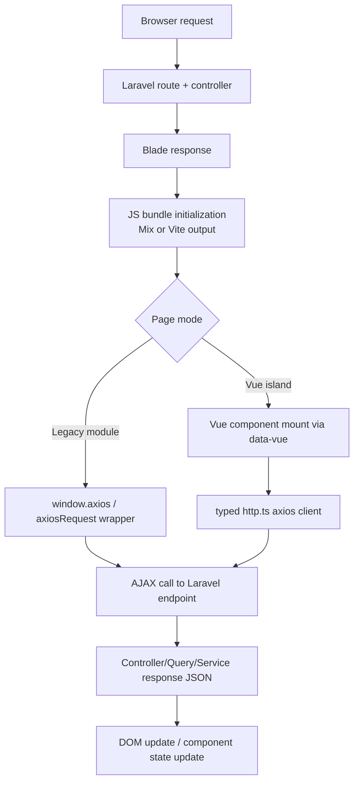

# Frontend Architecture

## Overview
The frontend is a hybrid stack that combines:
- Server-rendered Blade templates (`resources/views/*`)
- Modular JavaScript for legacy and transactional pages
- Vue 3 components mounted as islands for admin/data-heavy screens

## Build Strategy
- Laravel Mix (`webpack.mix.js`)
  - Builds many page-level and module-level bundles into `public/js/*`
  - Used heavily by existing frontend/admin modules
- Vite (`vite.config.ts`)
  - Builds `resources/js/app.ts` and selected modern entries
  - Supports Vue 3 and TypeScript modules

This dual pipeline allows incremental migration without disrupting existing pages.

## Runtime Composition
- Global bootstrap:
  - `resources/js/bootstrap.js` initializes axios defaults
- Legacy/shared modules:
  - `resources/js/shared/index.js` registers common utilities (request, modal, loading, form helpers)
- Vue mount strategy:
  - `resources/js/legacy/mounts.ts` mounts components by `data-vue` attributes
  - `resources/js/app.ts` remounts after ajax/navigation hooks

## Request Layers
- Legacy request helper:
  - `resources/js/shared/request-axios.js`
  - callback-driven wrapper around axios, used by many existing modules
- Typed request helper for newer Vue components:
  - `resources/js/lib/http.ts`
  - axios instance + standardized error normalization/interceptors

## Admin Data Flow
- Vue datatable components call `/admin/api/*` endpoints
- Server-side filtering, pagination, and export orchestration are handled by Laravel controllers/actions
- Example APIs include categories, brands, products, orders, payments, and export-job polling

## Mermaid: Frontend Request Flow

## Practical Outcome
- Stable Blade-first delivery remains intact
- Modern Vue components can be added screen-by-screen
- Request behavior remains consistent through shared axios conventions