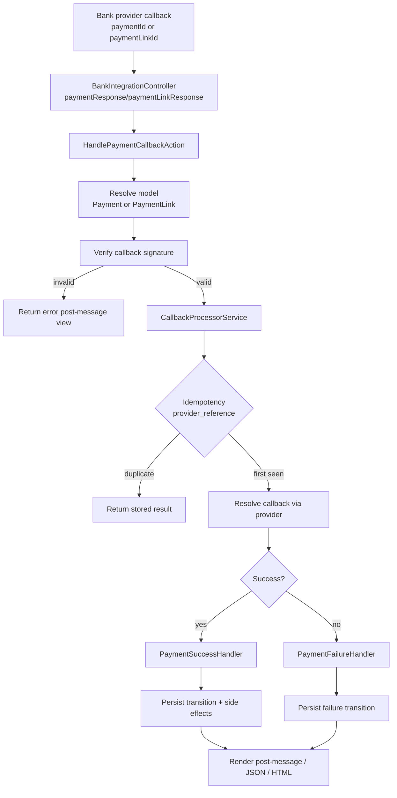

# Payment Flow

## Scope
This flow covers card payments and payment-link payments handled by:
- [`routes/frontend/bank-integration.php`](../routes/frontend/bank-integration.php)
- [`app/Http/Controllers/BankIntegrationController.php`](../app/Http/Controllers/BankIntegrationController.php)

## Main Endpoints
- `POST /bank-integrations/payment/request`
- `POST /bank-integrations/payment/response`
- `POST /bank-integrations/payment-link/request/{token}`
- `POST /bank-integrations/payment-link/response`

## Callback Processing Pipeline
The callback pipeline is centralized in the payment application layer:
- `ProcessPaymentResponseAction` / `ProcessPaymentLinkResponseAction`
- `HandlePaymentCallbackAction`
- `CallbackModelResolver`
- `CallbackSignatureValidator`
- `CallbackProcessorService`
- `PaymentSuccessHandler` / `PaymentFailureHandler`

## Idempotency and Safety
- Callback deduplication is backed by `payment_callback_idempotencies`
- Unique key: `(flow_type, model_type, model_id, provider_reference)`
- Payment state transitions are guarded with:
  - `lockForUpdate` on payment rows
  - explicit state rules in `PaymentStateMachine`
  - payload safety checks (`OID` consistency and user association)

## Mermaid: Payment Callback Flow

## State Outcomes
- `SUCCESS`: payment completed and side effects executed
- `FAILED`: payment marked failed with failure reason
- `REFUNDED` / `CANCELLED`: handled through admin refund/cancel flow with gateway call + transition update