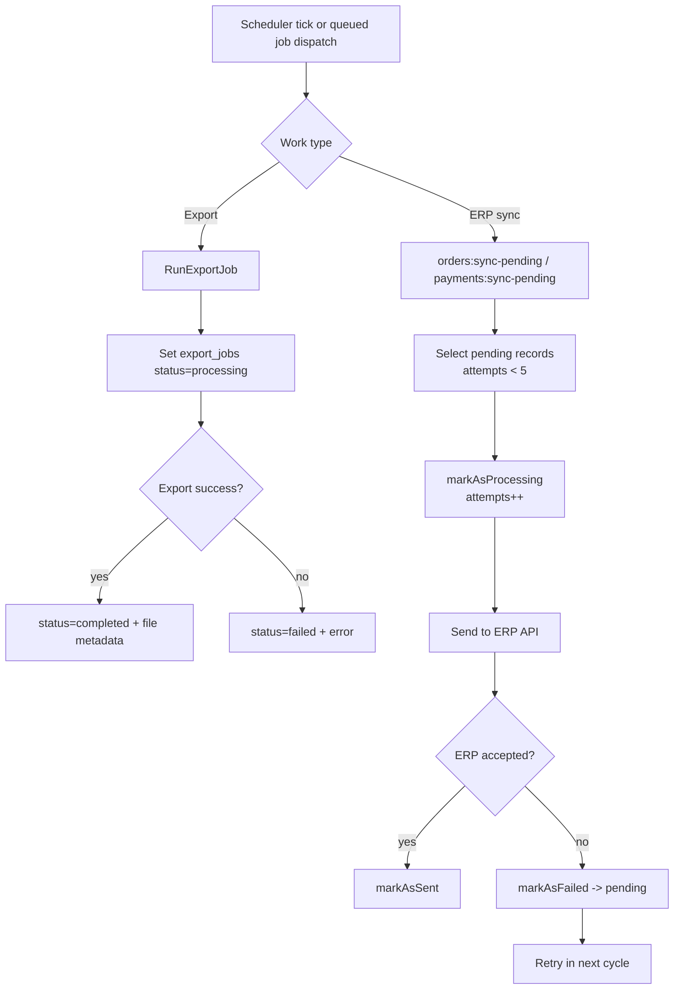

# Queue and Retry Strategy

## Scope
This document explains how retry and background execution are implemented for:
- Queue-based export jobs
- Scheduler-driven ERP sync loops (orders and payments)

## Queue Configuration
- Queue config: [`config/queue.php`](../config/queue.php)
- Default connection is environment-driven (`QUEUE_CONNECTION`, default `sync`)
- Database queue is supported through `jobs` and `failed_jobs` tables

## Queue-backed Export Pipeline
- Export requests create `export_jobs` records with `status = pending`
- `RunExportJob` is dispatched to the queue
- Job lifecycle updates:
  - `pending` -> `processing` -> `completed` or `failed`
- `RunExportJob` currently sets `public int $tries = 1`
- Clients poll export status via `/admin/api/exports/{id}`

## Scheduler-driven Retry Pipelines
Scheduler source: [`app/Console/Kernel.php`](../app/Console/Kernel.php)

Commands:
- `orders:sync-pending` (every 15 minutes)
- `payments:sync-pending` (every 15 minutes)

Retry model:
- Candidate records must satisfy:
  - `erp_status = pending`
  - `erp_attempts < 5`
  - `erp_processing_at` is null or stale (>15 minutes)
- `markAsProcessing` increments attempts atomically
- Failure resets status back to `pending` and stores error metadata
- Next scheduler cycle retries eligible records

## Concurrency and Duplicate Protection
- ERP push services use `BatchLockService` to avoid concurrent execution for same record
- Payment callback path uses DB-backed idempotency (`payment_callback_idempotencies`) to prevent duplicate callback effects
- Payment transitions use row-level locks (`lockForUpdate`) before status mutation

## Mermaid: Queue/Retry Flow

## Operational Notes
- Queue health is critical for export UX.
- Scheduler health is critical for ERP eventual consistency.
- Retry caps and stale-processing windows are implemented at query level and repository updates.